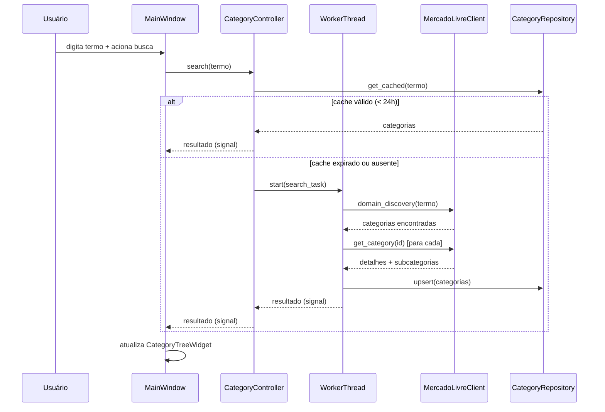

# Design Técnico — Mercado Livre Category Browser

## Visão Geral

O **Mercado Livre Category Browser** é uma aplicação desktop Python/PyQt6 que permite explorar a árvore de categorias do Mercado Livre Brasil (MLB). A aplicação consome a API REST pública do Mercado Livre, persiste os dados em SQLite e exibe a hierarquia em uma interface gráfica responsiva.

### Decisões de Design Principais

| Decisão | Escolha | Justificativa |
|---|---|---|
| Framework GUI | PyQt6 | Requisito explícito; maturidade e suporte nativo a threads |
| Concorrência | `QThread` + Worker Object Pattern | Padrão recomendado para PyQt6; evita bloqueio da event loop |
| HTTP Client | `requests` + `urllib3.util.retry.Retry` | Suporte nativo a retry com backoff exponencial |
| Persistência | SQLite via `sqlite3` (stdlib) | Zero dependências externas; adequado para dados locais |
| Logging | `logging.handlers.RotatingFileHandler` | Rotação automática de logs; stdlib Python |
| Configuração | `QSettings` (PyQt6) | Persiste estado da janela de forma nativa por plataforma |

---

## Arquitetura

A aplicação segue uma arquitetura em camadas com separação clara de responsabilidades:

```
┌─────────────────────────────────────────────────────────┐
│                    Camada de Apresentação                │
│  MainWindow  │  CategoryTreeWidget  │  DetailPanel       │
│  SearchBar   │  StatusBar           │  ExportDialog      │
└──────────────────────────┬──────────────────────────────┘
                           │ Signals / Slots
┌──────────────────────────▼──────────────────────────────┐
│                    Camada de Aplicação                   │
│  CategoryController  │  WorkerThread  │  AppSettings     │
└──────────┬───────────────────────────────────┬──────────┘
           │                                   │
┌──────────▼──────────┐           ┌────────────▼──────────┐
│  Camada de Serviços │           │  Camada de Persistência│
│  MercadoLivreClient │           │  CategoryRepository    │
│  RetryPolicy        │           │  DatabaseManager       │
└─────────────────────┘           └───────────────────────┘
```

### Fluxo de Dados Principal



---

## Componentes e Interfaces

### 1. `MercadoLivreClient`

Responsável por todas as chamadas HTTP à API do Mercado Livre.

```python
class MercadoLivreClient:
    BASE_URL = "https://api.mercadolibre.com"

    def get_root_categories(self) -> list[CategoryDTO]:
        """GET /sites/MLB/categories"""

    def search_categories(self, query: str) -> list[CategoryDTO]:
        """GET /sites/MLB/domain_discovery/search?q={query}"""

    def get_category_detail(self, category_id: str) -> CategoryDetailDTO:
        """GET /categories/{category_id}"""
```

**Política de Retry** (implementada via `urllib3.util.retry.Retry` + `requests.adapters.HTTPAdapter`):
- Máximo de 3 tentativas
- Backoff exponencial: 2s, 4s, 8s
- Retry em: erros de rede transitórios (timeout, conexão recusada)
- HTTP 429: respeita cabeçalho `Retry-After` (fallback: 60s)
- HTTP 4xx (exceto 429): não retenta — falha imediata
- HTTP 5xx: retenta com backoff

### 2. `CategoryController`

Orquestra a lógica de negócio entre a UI, o cliente HTTP e o repositório.

```python
class CategoryController(QObject):
    search_completed = pyqtSignal(list)   # list[CategoryDTO]
    load_completed = pyqtSignal(list)     # list[CategoryDTO]
    error_occurred = pyqtSignal(str)      # mensagem de erro
    progress_changed = pyqtSignal(str)    # mensagem de status

    def search(self, query: str) -> None: ...
    def load_root_categories(self) -> None: ...
    def cancel_current_operation(self) -> None: ...
    def export_data(self, path: str, fmt: str) -> None: ...
```

### 3. `ApiWorker` (QRunnable / QThread Worker)

Executa operações de rede em thread separada, comunicando resultados via signals.

```python
class ApiWorker(QRunnable):
    class Signals(QObject):
        finished = pyqtSignal(object)
        error = pyqtSignal(str)
        progress = pyqtSignal(str)

    def __init__(self, task: Callable, *args, **kwargs): ...
    def run(self) -> None: ...
```

O padrão Worker Object (instância de `QRunnable` submetida a `QThreadPool`) é preferido ao subclassing de `QThread` por ser mais simples de reutilizar e evitar o problema de "GUI freeze on second run" causado por `deleteLater()` prematuro.

### 4. `CategoryRepository`

Abstrai todas as operações de leitura e escrita no SQLite.

```python
class CategoryRepository:
    def upsert(self, category: CategoryDTO) -> None: ...
    def get_by_id(self, category_id: str) -> CategoryDTO | None: ...
    def get_children(self, parent_id: str | None) -> list[CategoryDTO]: ...
    def get_all(self) -> list[CategoryDTO]: ...
    def is_stale(self, category_id: str, max_age_hours: int = 24) -> bool: ...
    def search_local(self, query: str) -> list[CategoryDTO]: ...
    def export_json(self, path: str) -> None: ...
    def export_csv(self, path: str) -> None: ...
```

### 5. `DatabaseManager`

Gerencia o ciclo de vida da conexão SQLite e as migrações de schema.

```python
class DatabaseManager:
    def __init__(self, db_path: str): ...
    def initialize(self) -> None:
        """Cria tabelas se não existirem; executa migrações."""
    def get_connection(self) -> sqlite3.Connection: ...
    def close(self) -> None: ...
```

### 6. `MainWindow` (PyQt6)

Janela principal da aplicação. Compõe todos os widgets e conecta signals/slots.

```python
class MainWindow(QMainWindow):
    def __init__(self): ...
    def _setup_ui(self) -> None: ...
    def _connect_signals(self) -> None: ...
    def _restore_state(self) -> None: ...
    def _save_state(self) -> None: ...
    def closeEvent(self, event: QCloseEvent) -> None: ...
```

### 7. `CategoryTreeWidget`

Widget de árvore hierárquica baseado em `QTreeWidget`.

```python
class CategoryTreeWidget(QTreeWidget):
    category_selected = pyqtSignal(str)  # category_id

    def populate(self, categories: list[CategoryDTO]) -> None: ...
    def expand_node(self, category_id: str) -> None: ...
    def clear_tree(self) -> None: ...
```

### 8. `AppSettings`

Persiste configurações e estado da janela usando `QSettings`.

```python
class AppSettings:
    def save_window_state(self, window: QMainWindow) -> None: ...
    def restore_window_state(self, window: QMainWindow) -> None: ...
    def get(self, key: str, default=None): ...
    def set(self, key: str, value) -> None: ...
```

---

## Modelos de Dados

### DTOs (Data Transfer Objects)

```python
from dataclasses import dataclass, field
from datetime import datetime

@dataclass
class CategoryDTO:
    id: str                          # ex.: "MLB1051"
    name: str                        # ex.: "Celulares e Telefones"
    parent_id: str | None            # None para Root_Categories
    level: int                       # 0 = raiz, 1 = filho, etc.
    total_items_in_this_category: int = 0
    path_from_root: list[dict] = field(default_factory=list)
    # [{"id": "MLB1051", "name": "Celulares e Telefones"}, ...]
    children_ids: list[str] = field(default_factory=list)
    updated_at: datetime = field(default_factory=datetime.utcnow)

@dataclass
class CategoryDetailDTO(CategoryDTO):
    """Versão enriquecida retornada por GET /categories/{id}"""
    picture: str | None = None
    permalink: str | None = None
    settings: dict = field(default_factory=dict)
```

### Schema SQLite

```sql
-- Tabela principal de categorias
CREATE TABLE IF NOT EXISTS categories (
    id          TEXT PRIMARY KEY,
    name        TEXT NOT NULL,
    parent_id   TEXT REFERENCES categories(id) ON DELETE SET NULL,
    level       INTEGER NOT NULL DEFAULT 0,
    total_items INTEGER NOT NULL DEFAULT 0,
    path_json   TEXT NOT NULL DEFAULT '[]',  -- JSON serializado de path_from_root
    updated_at  TEXT NOT NULL                -- ISO 8601 UTC
);

-- Índices para consultas frequentes
CREATE INDEX IF NOT EXISTS idx_categories_parent_id ON categories(parent_id);
CREATE INDEX IF NOT EXISTS idx_categories_name      ON categories(name COLLATE NOCASE);
CREATE INDEX IF NOT EXISTS idx_categories_updated   ON categories(updated_at);

-- Tabela de configurações da aplicação
CREATE TABLE IF NOT EXISTS app_config (
    key   TEXT PRIMARY KEY,
    value TEXT NOT NULL
);
```

**Decisão de design — estrutura hierárquica:** Utiliza o padrão **Adjacency List** (coluna `parent_id` auto-referencial). Para a profundidade típica da árvore do Mercado Livre (3–5 níveis), este modelo é suficiente e mais simples que Nested Sets ou Closure Tables. Consultas de subárvore completa podem usar CTEs recursivas do SQLite 3.35+.

### Estrutura de Diretórios da Aplicação

```
~/.mercadolivre-browser/      # diretório de dados do usuário
├── categories.db             # banco SQLite
├── app.log                   # log atual
├── app.log.1                 # log rotacionado
└── config.ini                # QSettings (Windows: registro; macOS/Linux: arquivo)
```

---

## Propriedades de Corretude

*Uma propriedade é uma característica ou comportamento que deve ser verdadeiro em todas as execuções válidas do sistema — essencialmente, uma declaração formal sobre o que o software deve fazer. Propriedades servem como ponte entre especificações legíveis por humanos e garantias de corretude verificáveis por máquina.*

### Propriedade 1: Unicidade de categorias no repositório

*Para qualquer* sequência de operações `upsert` com o mesmo `category_id`, o repositório SHALL conter exatamente um registro para aquele id — independentemente de quantas vezes o upsert for chamado.

**Valida: Requisito 4.6**

---

### Propriedade 2: Round-trip de serialização JSON

*Para qualquer* `CategoryDTO` válido, serializar `path_from_root` para JSON e desserializar deve produzir um objeto equivalente ao original.

**Valida: Requisito 4.1**

---

### Propriedade 3: Detecção de dados obsoletos (staleness)

*Para qualquer* categoria armazenada com `updated_at` há mais de 24 horas, `is_stale()` SHALL retornar `True`; para qualquer categoria atualizada há menos de 24 horas, SHALL retornar `False`.

**Valida: Requisito 4.3**

---

### Propriedade 4: Validação de busca vazia

*Para qualquer* string composta inteiramente de espaços em branco (incluindo string vazia), a operação de busca SHALL ser rejeitada sem consultar a API, e o estado do `Result_Panel` SHALL permanecer inalterado.

**Valida: Requisito 1.4**

---

### Propriedade 5: Política de retry com backoff exponencial

*Para qualquer* sequência de falhas de rede transitórias, o `MercadoLivreClient` SHALL realizar no máximo 3 tentativas, e o intervalo entre tentativas SHALL crescer exponencialmente (2s, 4s, 8s), nunca excedendo 3 tentativas totais.

**Valida: Requisito 6.2**

---

### Propriedade 6: Consistência hierárquica pai-filho

*Para qualquer* categoria com `parent_id` não nulo armazenada no repositório, o pai referenciado SHALL existir no repositório (integridade referencial). Equivalentemente, `get_children(parent_id)` SHALL retornar apenas categorias cujo `parent_id` corresponde ao argumento.

**Valida: Requisito 2.2, 4.1**

---

### Propriedade 7: Exportação completa e fiel

*Para qualquer* conjunto de categorias armazenadas no repositório, exportar para JSON e reimportar SHALL produzir um conjunto de categorias com os mesmos `id`, `name`, `parent_id` e `level` — sem perda de dados.

**Valida: Requisito 4.4**

---

## Tratamento de Erros

### Hierarquia de Exceções

```python
class AppError(Exception): ...

class ApiError(AppError):
    def __init__(self, message: str, status_code: int | None = None): ...

class ApiRateLimitError(ApiError):
    def __init__(self, retry_after: int = 60): ...

class ApiNetworkError(AppError): ...

class StorageError(AppError): ...

class ValidationError(AppError): ...
```

### Mapeamento de Erros para Mensagens ao Usuário

| Situação | Mensagem exibida no Status_Bar |
|---|---|
| Campo de busca vazio | "Por favor, digite um termo para buscar." |
| HTTP 429 | "Limite de requisições atingido. Aguardando {n}s para nova tentativa..." |
| HTTP 4xx (outros) | "Erro na requisição (HTTP {code}). Verifique o termo buscado." |
| HTTP 5xx | "Serviço temporariamente indisponível (HTTP {code}). Tentando novamente..." |
| Timeout / sem rede | "Sem conexão com a internet. Exibindo dados salvos localmente." |
| Todas as tentativas falharam | "Não foi possível conectar à API. Verifique sua conexão e tente novamente." |
| Falha no SQLite | "Erro ao salvar dados localmente. Os resultados foram exibidos, mas não persistidos." |
| Banco corrompido | "Banco de dados local inacessível. Iniciando com dados vazios." |

### Logging

- Biblioteca: `logging` (stdlib) com `RotatingFileHandler`
- Arquivo: `~/.mercadolivre-browser/app.log`
- Rotação: 10 MB por arquivo, 2 backups mantidos
- Formato: `%(asctime)s [%(levelname)s] %(name)s: %(message)s`
- Níveis: `DEBUG` em desenvolvimento, `INFO` em produção

---

## Estratégia de Testes

### Abordagem Dual

A estratégia combina testes de exemplo (unitários/integração) com testes baseados em propriedades (PBT) para cobertura abrangente.

### Testes Unitários (pytest)

Focados em comportamentos específicos e casos de borda:

- `test_client.py`: mock de `requests.Session`; verifica chamadas HTTP corretas, parsing de respostas, tratamento de erros HTTP
- `test_repository.py`: banco SQLite em memória (`:memory:`); verifica upsert, deduplicação, consultas hierárquicas, detecção de staleness
- `test_controller.py`: mock de `MercadoLivreClient` e `CategoryRepository`; verifica orquestração, cancelamento de operações
- `test_validation.py`: validação de entrada (busca vazia, termos inválidos)
- `test_export.py`: exportação JSON e CSV com dados conhecidos

### Testes Baseados em Propriedades (Hypothesis)

Biblioteca: **[Hypothesis](https://hypothesis.readthedocs.io/)** — padrão de facto para PBT em Python.

Cada teste de propriedade executa mínimo de **100 iterações** com inputs gerados aleatoriamente.

Tag de referência: `# Feature: mercadolivre-category-browser, Property {N}: {texto}`

#### Propriedade 1 — Unicidade no repositório
```python
# Feature: mercadolivre-category-browser, Property 1: upsert idempotência
@given(category=st.builds(CategoryDTO, ...))
@settings(max_examples=100)
def test_upsert_idempotency(category):
    repo = CategoryRepository(":memory:")
    repo.upsert(category)
    repo.upsert(category)  # segunda vez
    results = repo.get_all()
    assert sum(1 for c in results if c.id == category.id) == 1
```

#### Propriedade 2 — Round-trip JSON
```python
# Feature: mercadolivre-category-browser, Property 2: serialização round-trip
@given(path=st.lists(st.fixed_dictionaries({"id": st.text(), "name": st.text()})))
@settings(max_examples=100)
def test_path_json_roundtrip(path):
    serialized = json.dumps(path)
    deserialized = json.loads(serialized)
    assert deserialized == path
```

#### Propriedade 3 — Detecção de staleness
```python
# Feature: mercadolivre-category-browser, Property 3: staleness detection
@given(hours_ago=st.floats(min_value=0, max_value=72))
@settings(max_examples=100)
def test_staleness_detection(hours_ago):
    updated_at = datetime.utcnow() - timedelta(hours=hours_ago)
    result = is_stale(updated_at, max_age_hours=24)
    assert result == (hours_ago > 24)
```

#### Propriedade 4 — Rejeição de busca vazia
```python
# Feature: mercadolivre-category-browser, Property 4: validação busca vazia
@given(query=st.text(alphabet=st.characters(whitelist_categories=["Zs", "Cc"])))
@settings(max_examples=100)
def test_empty_search_rejected(query):
    # query composta apenas de whitespace
    assume(query.strip() == "")
    with pytest.raises(ValidationError):
        validate_search_query(query)
```

#### Propriedade 5 — Backoff exponencial
```python
# Feature: mercadolivre-category-browser, Property 5: retry backoff
@given(attempt=st.integers(min_value=1, max_value=3))
@settings(max_examples=100)
def test_exponential_backoff(attempt):
    delay = compute_backoff_delay(attempt)
    expected = 2 ** attempt
    assert delay == expected
```

#### Propriedade 6 — Consistência pai-filho
```python
# Feature: mercadolivre-category-browser, Property 6: hierarquia pai-filho
@given(categories=st.lists(st.builds(CategoryDTO, ...), min_size=1, max_size=20))
@settings(max_examples=100)
def test_parent_child_consistency(categories):
    repo = CategoryRepository(":memory:")
    for cat in categories:
        repo.upsert(cat)
    for cat in categories:
        if cat.parent_id:
            children = repo.get_children(cat.parent_id)
            assert any(c.id == cat.id for c in children)
```

#### Propriedade 7 — Exportação fiel
```python
# Feature: mercadolivre-category-browser, Property 7: exportação round-trip
@given(categories=st.lists(st.builds(CategoryDTO, ...), min_size=1, max_size=50))
@settings(max_examples=100)
def test_export_roundtrip(categories, tmp_path):
    repo = CategoryRepository(":memory:")
    for cat in categories:
        repo.upsert(cat)
    export_path = tmp_path / "export.json"
    repo.export_json(str(export_path))
    imported = json.loads(export_path.read_text())
    exported_ids = {c["id"] for c in imported}
    original_ids = {c.id for c in categories}
    assert exported_ids == original_ids
```

### Testes de Integração

- Verificam a inicialização do banco de dados (criação de tabelas, índices)
- Verificam o fluxo completo: busca → API mock → persistência → exibição
- Executados com banco SQLite em arquivo temporário

### Testes de UI (pytest-qt)

- Verificam que a janela principal inicializa com dimensões mínimas corretas
- Verificam que Enter no `SearchBar` aciona a busca
- Verificam que o `StatusBar` exibe mensagens de erro corretamente
