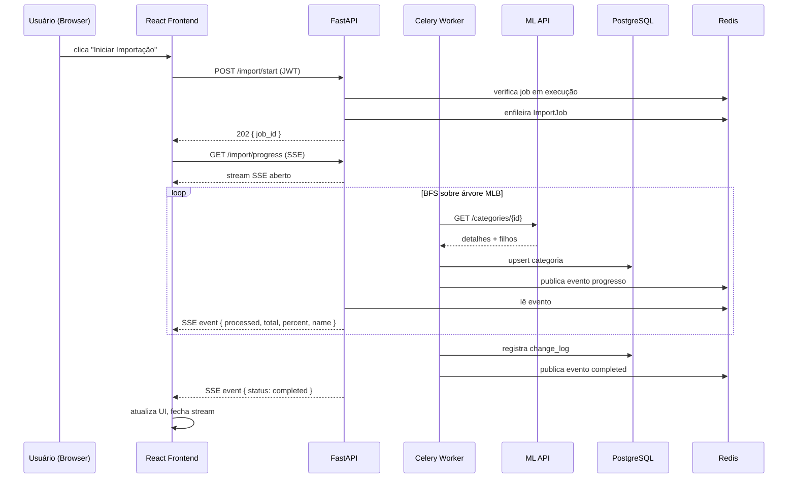
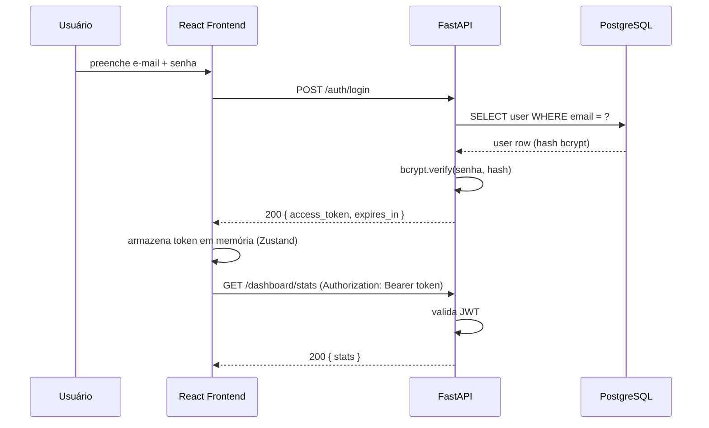

# Design Técnico — ML Category Web

## Visão Geral

O **ML Category Web** é uma aplicação web full-stack que substitui e expande o sistema desktop de exploração de categorias do Mercado Livre Brasil (MLB). A aplicação permite que múltiplos usuários autenticados pesquisem, naveguem e exportem a árvore hierárquica de categorias via navegador, com importação em background via Celery, progresso em tempo real via SSE, atualização automática agendada e uma API REST pública para integração com sistemas externos.

### Decisões de Design Principais

| Decisão | Escolha | Justificativa |
|---|---|---|
| Framework backend | FastAPI (Python 3.12) | Async nativo, OpenAPI automático, tipagem forte com Pydantic |
| ORM | SQLAlchemy 2.x (async) + Alembic | Migrations versionadas, suporte async, compatível com PostgreSQL |
| Autenticação | JWT (python-jose) + bcrypt | Stateless, escalável, sem sessão server-side |
| Fila de tarefas | Celery 5 + Redis | Maturidade, suporte a beat scheduler, monitoramento via Flower |
| Cache | Redis (via `redis-py`) | Já presente para Celery; reutilizado para cache de respostas |
| Frontend | React 18 + Vite + TypeScript | SPA moderna, build rápido, tipagem end-to-end |
| Estado global | Zustand | Leve, sem boilerplate, adequado para SPA de médio porte |
| HTTP client (frontend) | Axios + React Query | Cache automático, retry, invalidação declarativa |
| Banco de dados | PostgreSQL 16 | Robustez, suporte a índices GIN para busca textual, JSONB |
| Deploy | Docker Compose + Nginx + Certbot | Reprodutível, isolado, SSL automático via Let's Encrypt |
| Reutilização desktop | `MercadoLivreClient`, `fetch_full_tree` | Código já testado; migrado para uso assíncrono no Celery worker |

---

## Arquitetura

```
┌─────────────────────────────────────────────────────────────────────┐
│                          Cliente (Navegador)                        │
│                    React SPA (Vite + TypeScript)                    │
│  Dashboard │ CategoryTree │ SearchBar │ ImportProgress │ ChangeLog  │
└──────────────────────────────┬──────────────────────────────────────┘
                               │ HTTPS (REST + SSE)
┌──────────────────────────────▼──────────────────────────────────────┐
│                        Nginx (Proxy Reverso)                        │
│              SSL Termination (Let's Encrypt / Certbot)              │
│   /api/*  → FastAPI :8000   │   /*  → React static files :80       │
└──────────┬──────────────────────────────────────────────────────────┘
           │
┌──────────▼──────────────────────────────────────────────────────────┐
│                         FastAPI (Python 3.12)                       │
│  Routers: auth │ categories │ import │ export │ changes │ dashboard │
│           scheduler │ public                                        │
│  Middleware: JWT Auth │ Rate Limiting │ CORS │ Error Handler        │
└──────┬──────────────────────────────────────┬───────────────────────┘
       │                                      │
┌──────▼──────────┐                  ┌────────▼────────────────────────┐
│   PostgreSQL 16  │                  │         Redis 7                 │
│  categories      │                  │  Celery broker + result backend │
│  users           │                  │  API response cache (5 min TTL) │
│  change_log      │                  │  Rate limit counters            │
│  import_jobs     │                  └────────┬────────────────────────┘
│  scheduler_config│                           │
└──────────────────┘                  ┌────────▼────────────────────────┐
                                      │      Celery Worker              │
                                      │  ImportJob (BFS fetch_full_tree) │
                                      │  MercadoLivreClient (reutilizado)│
                                      └─────────────────────────────────┘
                                               │
                                      ┌────────▼────────────────────────┐
                                      │      Celery Beat                │
                                      │  Agendamento: a cada 24h        │
                                      └─────────────────────────────────┘
```

### Diagrama de Sequência — Importação com Progresso SSE



### Diagrama de Sequência — Autenticação



---

## Estrutura de Diretórios do Projeto

```
ml-category-web/
├── backend/
│   ├── app/
│   │   ├── __init__.py
│   │   ├── main.py                  # FastAPI app factory
│   │   ├── config.py                # Settings via pydantic-settings
│   │   ├── database.py              # SQLAlchemy async engine + session
│   │   ├── dependencies.py          # FastAPI Depends (auth, db, cache)
│   │   ├── models/
│   │   │   ├── __init__.py
│   │   │   ├── category.py          # ORM: Category
│   │   │   ├── user.py              # ORM: User
│   │   │   ├── import_job.py        # ORM: ImportJob
│   │   │   ├── change_log.py        # ORM: ChangeLog
│   │   │   └── scheduler_config.py  # ORM: SchedulerConfig
│   │   ├── schemas/
│   │   │   ├── __init__.py
│   │   │   ├── auth.py              # Pydantic: LoginRequest, TokenResponse
│   │   │   ├── category.py          # Pydantic: CategoryOut, CategoryDetail
│   │   │   ├── import_job.py        # Pydantic: ImportStatusOut, SSEEvent
│   │   │   ├── change_log.py        # Pydantic: ChangeLogOut, ChangeSummary
│   │   │   └── dashboard.py         # Pydantic: DashboardStats
│   │   ├── routers/
│   │   │   ├── __init__.py
│   │   │   ├── auth.py              # POST /auth/register, /login, /refresh
│   │   │   ├── categories.py        # GET /categories, /{id}, /{id}/children, /search
│   │   │   ├── import_router.py     # POST /import/start, GET /import/status, /progress
│   │   │   ├── export.py            # GET /export
│   │   │   ├── changes.py           # GET /changes, /changes/summary
│   │   │   ├── dashboard.py         # GET /dashboard/stats
│   │   │   ├── scheduler.py         # GET /scheduler/status, PUT /scheduler/config
│   │   │   └── public.py            # GET /public/categories, /search
│   │   ├── services/
│   │   │   ├── __init__.py
│   │   │   ├── auth_service.py      # JWT, bcrypt, token validation
│   │   │   ├── category_service.py  # Lógica de negócio de categorias
│   │   │   ├── import_service.py    # Orquestra ImportJob
│   │   │   ├── export_service.py    # Geração de JSON/CSV
│   │   │   ├── cache_service.py     # Wrapper Redis cache
│   │   │   └── rate_limiter.py      # Rate limiting por IP
│   │   └── workers/
│   │       ├── __init__.py
│   │       ├── celery_app.py        # Celery app factory
│   │       ├── import_task.py       # @celery.task: import_categories
│   │       └── ml_client.py         # Reutilizado do desktop (adaptado)
│   ├── alembic/
│   │   ├── env.py
│   │   ├── script.py.mako
│   │   └── versions/
│   │       └── 0001_initial_schema.py
│   ├── tests/
│   │   ├── conftest.py
│   │   ├── test_auth.py
│   │   ├── test_categories.py
│   │   ├── test_import.py
│   │   ├── test_export.py
│   │   ├── test_changes.py
│   │   ├── test_dashboard.py
│   │   ├── test_public_api.py
│   │   ├── test_rate_limiter.py
│   │   └── properties/
│   │       ├── test_prop_search.py
│   │       ├── test_prop_export.py
│   │       ├── test_prop_auth.py
│   │       └── test_prop_import.py
│   ├── Dockerfile
│   ├── pyproject.toml
│   └── .env.example
├── frontend/
│   ├── src/
│   │   ├── main.tsx
│   │   ├── App.tsx
│   │   ├── api/
│   │   │   ├── client.ts            # Axios instance + interceptors
│   │   │   ├── auth.ts
│   │   │   ├── categories.ts
│   │   │   ├── import.ts
│   │   │   ├── export.ts
│   │   │   ├── changes.ts
│   │   │   └── dashboard.ts
│   │   ├── components/
│   │   │   ├── auth/
│   │   │   │   ├── LoginForm.tsx
│   │   │   │   └── RegisterForm.tsx
│   │   │   ├── categories/
│   │   │   │   ├── CategoryTree.tsx
│   │   │   │   ├── CategoryNode.tsx
│   │   │   │   ├── CategoryDetail.tsx
│   │   │   │   └── SearchBar.tsx
│   │   │   ├── import/
│   │   │   │   ├── ImportButton.tsx
│   │   │   │   └── ImportProgress.tsx
│   │   │   ├── dashboard/
│   │   │   │   ├── StatsCards.tsx
│   │   │   │   └── LevelChart.tsx
│   │   │   ├── changes/
│   │   │   │   └── ChangeLogTable.tsx
│   │   │   └── shared/
│   │   │       ├── Navbar.tsx
│   │   │       ├── ProtectedRoute.tsx
│   │   │       └── ErrorBoundary.tsx
│   │   ├── pages/
│   │   │   ├── LoginPage.tsx
│   │   │   ├── RegisterPage.tsx
│   │   │   ├── DashboardPage.tsx
│   │   │   ├── BrowsePage.tsx
│   │   │   ├── SearchPage.tsx
│   │   │   └── ChangesPage.tsx
│   │   ├── store/
│   │   │   ├── authStore.ts         # Zustand: token em memória
│   │   │   └── importStore.ts       # Zustand: estado da importação
│   │   ├── hooks/
│   │   │   ├── useSSE.ts            # Hook para EventSource SSE
│   │   │   └── useCategories.ts     # React Query hooks
│   │   └── types/
│   │       └── index.ts             # TypeScript interfaces
│   ├── public/
│   ├── index.html
│   ├── vite.config.ts
│   ├── tsconfig.json
│   ├── package.json
│   └── Dockerfile
├── nginx/
│   ├── nginx.conf
│   └── ssl/                         # Certbot popula este diretório
├── docker-compose.yml
├── docker-compose.prod.yml
├── .env.example
└── README.md
```

---

## Componentes e Interfaces

### Backend — FastAPI

#### Router: `/auth`

```python
# POST /auth/register
class RegisterRequest(BaseModel):
    email: EmailStr
    password: str = Field(min_length=8)

class TokenResponse(BaseModel):
    access_token: str
    token_type: str = "bearer"
    expires_in: int = 86400  # 24h em segundos

# POST /auth/login
class LoginRequest(BaseModel):
    email: EmailStr
    password: str

# POST /auth/refresh
# Header: Authorization: Bearer {token}
# Response: TokenResponse
```

#### Router: `/categories`

```python
class CategoryOut(BaseModel):
    id: str
    name: str
    parent_id: str | None
    level: int
    total_items: int
    path_from_root: list[PathNode]

class PathNode(BaseModel):
    id: str
    name: str

class CategoryDetail(CategoryOut):
    children: list[CategoryOut]

class SearchResponse(BaseModel):
    items: list[CategoryOut]
    total: int
    page: int
    page_size: int

# GET /categories                          → list[CategoryOut]  (root categories)
# GET /categories/search?q=&page=&page_size= → SearchResponse
# GET /categories/{id}                     → CategoryDetail
# GET /categories/{id}/children            → list[CategoryOut]
```

#### Router: `/import`

```python
class ImportStartResponse(BaseModel):
    job_id: str
    status: str = "pending"

class ImportStatusOut(BaseModel):
    job_id: str
    status: Literal["pending", "running", "completed", "failed"]
    processed: int
    total_estimated: int
    started_at: datetime | None
    finished_at: datetime | None
    error_count: int

class SSEProgressEvent(BaseModel):
    processed: int
    total_estimated: int
    percent: float
    current_category: str
    status: str

# POST /import/start  → 202 ImportStartResponse  (ou 409 se já em execução)
# GET  /import/status → ImportStatusOut
# GET  /import/progress → text/event-stream (SSE)
```

#### Router: `/export`

```python
# GET /export?format=json&root_id=MLB1051
# Response: StreamingResponse com Content-Disposition attachment
```

#### Router: `/changes`

```python
class ChangeLogOut(BaseModel):
    id: int
    change_type: Literal["added", "removed"]
    category_id: str
    category_name: str
    parent_id: str | None
    detected_at: datetime
    import_job_id: str

class ChangeSummaryItem(BaseModel):
    month: str          # "2024-01"
    added: int
    removed: int

# GET /changes?type=&category_id=&from_date=&to_date=&page=&page_size=
# GET /changes/summary → list[ChangeSummaryItem] (últimos 12 meses)
```

#### Router: `/dashboard`

```python
class DashboardStats(BaseModel):
    total_categories: int
    total_root_categories: int
    total_leaf_categories: int
    max_depth: int
    last_import_at: datetime | None
    changes_last_30_days: int
    categories_by_level: dict[int, int]

# GET /dashboard/stats → DashboardStats
```

#### Router: `/scheduler`

```python
class SchedulerStatus(BaseModel):
    active: bool
    last_run_at: datetime | None
    next_run_at: datetime | None
    last_run_result: str | None
    interval_hours: int

class SchedulerConfigUpdate(BaseModel):
    interval_hours: int = Field(ge=1, le=168)

# GET /scheduler/status → SchedulerStatus
# PUT /scheduler/config → SchedulerStatus
```

#### Router: `/public`

```python
# GET /public/categories                          → list[CategoryOut]
# GET /public/categories/{id}                     → CategoryDetail
# GET /public/categories/{id}/children            → list[CategoryOut]
# GET /public/categories/search?q=&page=&page_size= → SearchResponse
# Rate limit: 60 req/min por IP (Redis sliding window)
```

### Celery Worker — `import_task.py`

```python
@celery_app.task(bind=True, name="import_categories")
def import_categories(self, job_id: str) -> dict:
    """
    Busca recursivamente toda a árvore MLB via MercadoLivreClient.
    Persiste cada categoria via upsert no PostgreSQL.
    Detecta adições/remoções e registra no change_log.
    Publica eventos de progresso no Redis (canal SSE).
    """
```

O `MercadoLivreClient` do desktop é reutilizado diretamente no worker Celery, com adaptação mínima: remoção das dependências PyQt6 (já inexistentes no módulo de serviços) e configuração de logging para stdout/stderr (capturado pelo Docker).

### Frontend — Componentes React Principais

#### `CategoryTree.tsx`

Árvore hierárquica com lazy loading. Cada nó carrega filhos sob demanda via `GET /categories/{id}/children`.

```typescript
interface CategoryTreeProps {
  onSelect: (category: CategoryOut) => void;
}

// Usa React Query para cache automático de nós já expandidos
// Usa Zustand para estado de expansão da árvore
```

#### `ImportProgress.tsx`

Conecta ao endpoint SSE e exibe barra de progresso em tempo real.

```typescript
// Usa o hook useSSE(url) que encapsula EventSource
// Atualiza importStore (Zustand) com eventos recebidos
// Fecha conexão SSE ao receber status "completed" ou "failed"
```

#### `useSSE.ts` (hook)

```typescript
function useSSE(url: string | null): {
  data: SSEProgressEvent | null;
  error: string | null;
  connected: boolean;
}
// Cria EventSource com token JWT no header via fetch polyfill
// Cleanup automático no unmount (fecha EventSource)
```

#### `authStore.ts` (Zustand)

```typescript
interface AuthState {
  token: string | null;           // NUNCA persiste em localStorage
  setToken: (token: string) => void;
  clearToken: () => void;
  isAuthenticated: boolean;
}
```

---

## Modelos de Dados

### Schema PostgreSQL

```sql
-- ============================================================
-- Extensões
-- ============================================================
CREATE EXTENSION IF NOT EXISTS "pgcrypto";  -- gen_random_uuid()

-- ============================================================
-- Tabela: users
-- ============================================================
CREATE TABLE users (
    id            UUID PRIMARY KEY DEFAULT gen_random_uuid(),
    email         TEXT NOT NULL UNIQUE,
    password_hash TEXT NOT NULL,           -- bcrypt hash
    created_at    TIMESTAMPTZ NOT NULL DEFAULT NOW(),
    updated_at    TIMESTAMPTZ NOT NULL DEFAULT NOW()
);

-- ============================================================
-- Tabela: categories
-- ============================================================
CREATE TABLE categories (
    id            TEXT PRIMARY KEY,        -- ex.: "MLB1051"
    name          TEXT NOT NULL,
    parent_id     TEXT REFERENCES categories(id) ON DELETE SET NULL,
    level         INTEGER NOT NULL DEFAULT 0,
    total_items   INTEGER NOT NULL DEFAULT 0,
    path_json     JSONB NOT NULL DEFAULT '[]',
    -- [{"id": "MLB1051", "name": "Celulares e Telefones"}, ...]
    updated_at    TIMESTAMPTZ NOT NULL DEFAULT NOW()
);

CREATE INDEX idx_categories_parent_id ON categories(parent_id);
CREATE INDEX idx_categories_level     ON categories(level);
CREATE INDEX idx_categories_name_trgm ON categories USING GIN (name gin_trgm_ops);
-- Requer: CREATE EXTENSION pg_trgm;

-- ============================================================
-- Tabela: import_jobs
-- ============================================================
CREATE TABLE import_jobs (
    id              UUID PRIMARY KEY DEFAULT gen_random_uuid(),
    status          TEXT NOT NULL DEFAULT 'pending'
                    CHECK (status IN ('pending','running','completed','failed')),
    processed       INTEGER NOT NULL DEFAULT 0,
    total_estimated INTEGER NOT NULL DEFAULT 0,
    error_count     INTEGER NOT NULL DEFAULT 0,
    started_at      TIMESTAMPTZ,
    finished_at     TIMESTAMPTZ,
    triggered_by    TEXT NOT NULL DEFAULT 'manual'
                    CHECK (triggered_by IN ('manual','scheduler')),
    created_at      TIMESTAMPTZ NOT NULL DEFAULT NOW()
);

CREATE INDEX idx_import_jobs_status     ON import_jobs(status);
CREATE INDEX idx_import_jobs_created_at ON import_jobs(created_at DESC);

-- ============================================================
-- Tabela: change_log
-- ============================================================
CREATE TABLE change_log (
    id              BIGSERIAL PRIMARY KEY,
    change_type     TEXT NOT NULL CHECK (change_type IN ('added','removed')),
    category_id     TEXT NOT NULL,
    category_name   TEXT NOT NULL,
    parent_id       TEXT,
    detected_at     TIMESTAMPTZ NOT NULL DEFAULT NOW(),
    import_job_id   UUID NOT NULL REFERENCES import_jobs(id) ON DELETE CASCADE
);

CREATE INDEX idx_change_log_detected_at    ON change_log(detected_at DESC);
CREATE INDEX idx_change_log_category_id    ON change_log(category_id);
CREATE INDEX idx_change_log_change_type    ON change_log(change_type);
CREATE INDEX idx_change_log_import_job_id  ON change_log(import_job_id);

-- ============================================================
-- Tabela: scheduler_config
-- ============================================================
CREATE TABLE scheduler_config (
    id              INTEGER PRIMARY KEY DEFAULT 1
                    CHECK (id = 1),        -- singleton
    interval_hours  INTEGER NOT NULL DEFAULT 24
                    CHECK (interval_hours BETWEEN 1 AND 168),
    active          BOOLEAN NOT NULL DEFAULT TRUE,
    last_run_at     TIMESTAMPTZ,
    next_run_at     TIMESTAMPTZ,
    last_run_result TEXT,
    updated_at      TIMESTAMPTZ NOT NULL DEFAULT NOW()
);

-- Seed: garante que sempre existe exatamente uma linha
INSERT INTO scheduler_config (id) VALUES (1) ON CONFLICT DO NOTHING;
```

### SQLAlchemy ORM Models (Python)

```python
# app/models/category.py
class Category(Base):
    __tablename__ = "categories"
    id: Mapped[str] = mapped_column(Text, primary_key=True)
    name: Mapped[str] = mapped_column(Text, nullable=False)
    parent_id: Mapped[str | None] = mapped_column(
        Text, ForeignKey("categories.id", ondelete="SET NULL"), nullable=True
    )
    level: Mapped[int] = mapped_column(Integer, default=0)
    total_items: Mapped[int] = mapped_column(Integer, default=0)
    path_json: Mapped[list] = mapped_column(JSONB, default=list)
    updated_at: Mapped[datetime] = mapped_column(
        TIMESTAMPTZ, server_default=func.now(), onupdate=func.now()
    )
    children: Mapped[list["Category"]] = relationship(
        "Category", back_populates="parent", foreign_keys=[parent_id]
    )
    parent: Mapped["Category | None"] = relationship(
        "Category", back_populates="children", remote_side=[id]
    )

# app/models/user.py
class User(Base):
    __tablename__ = "users"
    id: Mapped[UUID] = mapped_column(primary_key=True, default=uuid4)
    email: Mapped[str] = mapped_column(Text, unique=True, nullable=False)
    password_hash: Mapped[str] = mapped_column(Text, nullable=False)
    created_at: Mapped[datetime] = mapped_column(TIMESTAMPTZ, server_default=func.now())
    updated_at: Mapped[datetime] = mapped_column(TIMESTAMPTZ, server_default=func.now())
```

### Pydantic Schemas (Request/Response)

Os schemas Pydantic são definidos separadamente dos modelos ORM para manter a separação entre camada de persistência e camada de API. Cada router importa apenas os schemas necessários, evitando acoplamento direto com os modelos SQLAlchemy.

---

## Propriedades de Corretude

*Uma propriedade é uma característica ou comportamento que deve ser verdadeiro em todas as execuções válidas do sistema — essencialmente, uma declaração formal sobre o que o software deve fazer. Propriedades servem como ponte entre especificações legíveis por humanos e garantias de corretude verificáveis por máquina.*

### Propriedade 1: Round-trip de autenticação (registro → login)

*Para qualquer* par válido de e-mail e senha, registrar o usuário e em seguida fazer login com as mesmas credenciais SHALL sempre retornar um JWT válido com validade de 24 horas, e o hash armazenado no banco SHALL nunca ser igual ao texto plano da senha.

**Valida: Requisitos 1.1, 1.2, 1.3**

---

### Propriedade 2: Rejeição de tokens inválidos ou expirados

*Para qualquer* string que não seja um JWT válido e não-expirado emitido pelo sistema, qualquer endpoint autenticado SHALL retornar HTTP 401.

**Valida: Requisito 1.7**

---

### Propriedade 3: Corretude e completude da busca de categorias

*Para qualquer* termo de busca com 2 ou mais caracteres e qualquer conjunto de categorias no banco, todos os itens retornados por `GET /categories/search` SHALL ter o nome contendo o termo (case-insensitive) e SHALL incluir os campos: `id`, `name`, `level`, `parent_id` e `path_from_root`.

**Valida: Requisitos 2.1, 2.2**

---

### Propriedade 4: Validação de termo de busca curto

*Para qualquer* string com comprimento menor que 2 caracteres (incluindo string vazia), `GET /categories/search?q={termo}` SHALL retornar HTTP 422.

**Valida: Requisito 2.4**

---

### Propriedade 5: Paginação nunca excede o limite

*Para qualquer* endpoint de listagem com parâmetro `page_size`, o número de itens retornados SHALL ser menor ou igual ao `page_size` solicitado, e nunca superior a 100.

**Valida: Requisitos 2.3, 12.5**

---

### Propriedade 6: Invariante de categorias raiz

*Para qualquer* estado do banco de dados, todos os itens retornados por `GET /categories` SHALL ter `parent_id` nulo e `level` igual a 0.

**Valida: Requisito 3.1**

---

### Propriedade 7: Consistência pai-filho

*Para qualquer* `category_id`, todos os itens retornados por `GET /categories/{category_id}/children` SHALL ter `parent_id` igual ao `category_id` fornecido.

**Valida: Requisito 3.2**

---

### Propriedade 8: Round-trip de persistência de categoria

*Para qualquer* categoria armazenada no banco, `GET /categories/{id}` SHALL retornar todos os campos com valores idênticos aos armazenados (`id`, `name`, `parent_id`, `level`, `total_items`, `path_from_root`).

**Valida: Requisito 3.3**

---

### Propriedade 9: Idempotência do upsert (sem duplicatas)

*Para qualquer* categoria, executar o upsert duas vezes com os mesmos dados SHALL resultar em exatamente um registro no banco com os dados mais recentes.

**Valida: Requisito 4.3**

---

### Propriedade 10: Completude da importação

*Para qualquer* conjunto de categorias retornado pelo ML_Client mockado, após a conclusão do Import_Job todas as categorias SHALL existir no banco de dados.

**Valida: Requisito 4.2**

---

### Propriedade 11: Detecção de mudanças no Change_Log

*Para qualquer* categoria presente no banco mas ausente na resposta do ML_Client, o Import_Job SHALL registrar uma entrada `removed` no change_log; e para qualquer categoria presente na resposta do ML_Client mas ausente no banco, SHALL registrar uma entrada `added`.

**Valida: Requisitos 4.4, 4.5**

---

### Propriedade 12: Resiliência do Import_Job a falhas parciais

*Para qualquer* conjunto de categorias onde um subconjunto falha durante a importação, o Import_Job SHALL incrementar o contador de erros para cada falha e SHALL continuar processando e persistindo as categorias restantes.

**Valida: Requisitos 4.8, 11.3**

---

### Propriedade 13: Completude dos eventos SSE de progresso

*Para qualquer* categoria processada durante o Import_Job, o evento SSE emitido SHALL conter os campos `processed`, `total_estimated`, `percent` e `current_category`, com `percent` sempre entre 0 e 100 e `processed` sempre menor ou igual a `total_estimated`.

**Valida: Requisito 5.2**

---

### Propriedade 14: Completude e corretude da exportação

*Para qualquer* conjunto de categorias armazenadas no banco, o Export_File gerado por `GET /export?format=json` SHALL conter todas as categorias com os campos `id`, `name`, `parent_id`, `level`, `total_items` e `path_from_root` preservados fielmente.

**Valida: Requisito 7.1**

---

### Propriedade 15: Exportação de subárvore

*Para qualquer* `root_id` válido, todos os itens no Export_File gerado por `GET /export?format=json&root_id={root_id}` SHALL ser descendentes diretos ou indiretos (ou a própria raiz) da categoria `root_id`.

**Valida: Requisito 7.6**

---

### Propriedade 16: Validação de formato de exportação

*Para qualquer* string que não seja `json` nem `csv`, `GET /export?format={string}` SHALL retornar HTTP 422.

**Valida: Requisito 7.4**

---

### Propriedade 17: Ordenação e completude do Change_Log

*Para qualquer* conjunto de registros no change_log, `GET /changes` SHALL retornar os registros em ordem decrescente de `detected_at`, e cada registro SHALL conter os campos: `id`, `change_type`, `category_id`, `category_name`, `parent_id`, `detected_at` e `import_job_id`.

**Valida: Requisitos 8.1, 8.2**

---

### Propriedade 18: Corretude dos filtros do Change_Log

*Para qualquer* combinação de parâmetros de filtro (`type`, `category_id`, `from_date`, `to_date`), todos os registros retornados por `GET /changes` SHALL satisfazer todos os critérios de filtro aplicados.

**Valida: Requisito 8.3**

---

### Propriedade 19: Consistência das estatísticas do Dashboard

*Para qualquer* estado do banco de dados, os valores retornados por `GET /dashboard/stats` SHALL ser consistentes com as contagens reais: `total_categories` igual ao COUNT(*) de categories, `total_root_categories` igual ao COUNT(*) WHERE parent_id IS NULL, e `total_leaf_categories` igual ao COUNT(*) de categorias sem filhos.

**Valida: Requisito 9.1**

---

### Propriedade 20: Rate limiting da Public API

*Para qualquer* endereço IP, após 60 requisições bem-sucedidas em uma janela de 1 minuto, a 61ª requisição SHALL retornar HTTP 429 com o cabeçalho `Retry-After` presente e com valor positivo.

**Valida: Requisitos 10.5, 10.6**

---

### Propriedade 21: Cabeçalho X-Total-Count nos endpoints de listagem públicos

*Para qualquer* endpoint de listagem da Public_API, o cabeçalho `X-Total-Count` SHALL estar presente na resposta e SHALL conter o número total de itens disponíveis (não apenas os da página atual).

**Valida: Requisito 10.7**

---

### Propriedade 22: Política de retry com backoff exponencial do ML_Client

*Para qualquer* número de tentativa `n` (1, 2 ou 3), o intervalo de espera antes da tentativa `n` SHALL ser `2^n` segundos (2s, 4s, 8s), e o total de tentativas SHALL nunca exceder 3.

**Valida: Requisitos 11.1, 11.2**

---

### Propriedade 23: Formato padronizado de respostas de erro

*Para qualquer* condição de erro que resulte em HTTP 4xx ou 5xx, o corpo da resposta SHALL ser um JSON contendo os campos `error` (string), `message` (string) e `timestamp` (ISO 8601).

**Valida: Requisito 11.4**

---

## Tratamento de Erros

### Hierarquia de Exceções (Backend)

```python
class AppError(Exception):
    """Base para todas as exceções da aplicação."""

class AuthError(AppError):
    """Erros de autenticação e autorização."""
    status_code: int = 401

class ConflictError(AppError):
    """Recurso já existe (ex.: e-mail duplicado, job em execução)."""
    status_code: int = 409

class NotFoundError(AppError):
    """Recurso não encontrado."""
    status_code: int = 404

class ValidationError(AppError):
    """Dados de entrada inválidos."""
    status_code: int = 422

class RateLimitError(AppError):
    """Rate limit excedido."""
    status_code: int = 429
    retry_after: int

class ServiceUnavailableError(AppError):
    """Serviço externo ou banco indisponível."""
    status_code: int = 503

# Reutilizados do desktop (sem dependência PyQt6):
class ApiError(AppError): ...
class ApiRateLimitError(ApiError): ...
class ApiNetworkError(AppError): ...
```

### Handler Global de Erros (FastAPI)

```python
@app.exception_handler(AppError)
async def app_error_handler(request: Request, exc: AppError):
    return JSONResponse(
        status_code=exc.status_code,
        content={
            "error": type(exc).__name__,
            "message": str(exc),
            "timestamp": datetime.utcnow().isoformat() + "Z",
        },
    )

@app.exception_handler(Exception)
async def unhandled_error_handler(request: Request, exc: Exception):
    logger.error("Unhandled error on %s: %s", request.url, exc, exc_info=True)
    return JSONResponse(
        status_code=500,
        content={
            "error": "InternalServerError",
            "message": "Erro interno do servidor. Tente novamente mais tarde.",
            "timestamp": datetime.utcnow().isoformat() + "Z",
        },
    )
```

### Mapeamento de Erros para Respostas HTTP

| Situação | HTTP | Mensagem |
|---|---|---|
| E-mail já cadastrado | 409 | "E-mail já está em uso." |
| Credenciais inválidas | 401 | "Credenciais inválidas." (genérica) |
| Token expirado/inválido | 401 | "Token de autenticação inválido ou expirado." |
| Termo de busca < 2 chars | 422 | "O termo de busca deve ter no mínimo 2 caracteres." |
| Formato de exportação inválido | 422 | "Formato inválido. Use 'json' ou 'csv'." |
| Import_Job já em execução | 409 | "Uma importação já está em andamento." |
| Categoria não encontrada | 404 | "Categoria '{id}' não encontrada." |
| Banco sem categorias (export) | 404 | "Não há categorias para exportar." |
| Rate limit excedido | 429 | "Limite de requisições excedido. Tente novamente em {n}s." |
| PostgreSQL inacessível | 503 | "Serviço temporariamente indisponível." |
| Redis inacessível | — | Log WARNING; API continua sem cache |
| ML API HTTP 429 | — | Worker aguarda Retry-After e retenta |
| ML API falha após 3 tentativas | — | Incrementa error_count; continua job |

### Logging

- Biblioteca: `structlog` (JSON estruturado) + `logging` stdlib
- Saída: stdout/stderr (capturado pelo Docker)
- Níveis: `DEBUG` em desenvolvimento, `INFO` em produção
- Formato: JSON com campos `timestamp`, `level`, `logger`, `message`, `request_id`
- Erros HTTP 5xx: nível `ERROR` com stack trace completo
- Erros HTTP 4xx: nível `WARNING` (sem stack trace)
- Celery tasks: nível `INFO` para início/fim, `ERROR` para falhas

---

## Configuração Docker Compose

### `docker-compose.yml` (desenvolvimento)

```yaml
version: "3.9"

services:
  db:
    image: postgres:16-alpine
    environment:
      POSTGRES_DB: ${POSTGRES_DB:-mlcategory}
      POSTGRES_USER: ${POSTGRES_USER:-mluser}
      POSTGRES_PASSWORD: ${POSTGRES_PASSWORD}
    volumes:
      - postgres_data:/var/lib/postgresql/data
    healthcheck:
      test: ["CMD-SHELL", "pg_isready -U ${POSTGRES_USER:-mluser}"]
      interval: 10s
      timeout: 5s
      retries: 5

  redis:
    image: redis:7-alpine
    command: redis-server --appendonly yes
    volumes:
      - redis_data:/data
    healthcheck:
      test: ["CMD", "redis-cli", "ping"]
      interval: 10s
      timeout: 5s
      retries: 5

  backend:
    build:
      context: ./backend
      dockerfile: Dockerfile
    environment:
      DATABASE_URL: postgresql+asyncpg://${POSTGRES_USER:-mluser}:${POSTGRES_PASSWORD}@db:5432/${POSTGRES_DB:-mlcategory}
      REDIS_URL: redis://redis:6379/0
      SECRET_KEY: ${SECRET_KEY}
      ENVIRONMENT: ${ENVIRONMENT:-development}
    depends_on:
      db:
        condition: service_healthy
      redis:
        condition: service_healthy
    ports:
      - "8000:8000"
    volumes:
      - ./backend:/app
    command: uvicorn app.main:app --host 0.0.0.0 --port 8000 --reload

  celery_worker:
    build:
      context: ./backend
      dockerfile: Dockerfile
    environment:
      DATABASE_URL: postgresql+asyncpg://${POSTGRES_USER:-mluser}:${POSTGRES_PASSWORD}@db:5432/${POSTGRES_DB:-mlcategory}
      REDIS_URL: redis://redis:6379/0
      SECRET_KEY: ${SECRET_KEY}
    depends_on:
      db:
        condition: service_healthy
      redis:
        condition: service_healthy
    command: celery -A app.workers.celery_app worker --loglevel=info --concurrency=2

  celery_beat:
    build:
      context: ./backend
      dockerfile: Dockerfile
    environment:
      DATABASE_URL: postgresql+asyncpg://${POSTGRES_USER:-mluser}:${POSTGRES_PASSWORD}@db:5432/${POSTGRES_DB:-mlcategory}
      REDIS_URL: redis://redis:6379/0
      SECRET_KEY: ${SECRET_KEY}
    depends_on:
      db:
        condition: service_healthy
      redis:
        condition: service_healthy
    command: celery -A app.workers.celery_app beat --loglevel=info --scheduler django_celery_beat.schedulers:DatabaseScheduler

  frontend:
    build:
      context: ./frontend
      dockerfile: Dockerfile
      target: development
    ports:
      - "5173:5173"
    volumes:
      - ./frontend:/app
      - /app/node_modules
    environment:
      VITE_API_URL: http://localhost:8000

  flower:
    image: mher/flower:2.0
    environment:
      CELERY_BROKER_URL: redis://redis:6379/0
    ports:
      - "5555:5555"
    depends_on:
      - redis

volumes:
  postgres_data:
  redis_data:
```

### `docker-compose.prod.yml` (produção — sobrepõe o base)

```yaml
version: "3.9"

services:
  backend:
    restart: unless-stopped
    volumes: []                          # sem bind mount em produção
    command: >
      sh -c "alembic upgrade head &&
             uvicorn app.main:app --host 0.0.0.0 --port 8000 --workers 4"
    environment:
      ENVIRONMENT: production

  celery_worker:
    restart: unless-stopped
    volumes: []
    command: celery -A app.workers.celery_app worker --loglevel=info --concurrency=4

  celery_beat:
    restart: unless-stopped
    volumes: []

  frontend:
    build:
      context: ./frontend
      dockerfile: Dockerfile
      target: production
    restart: unless-stopped

  nginx:
    image: nginx:1.25-alpine
    restart: unless-stopped
    ports:
      - "80:80"
      - "443:443"
    volumes:
      - ./nginx/nginx.conf:/etc/nginx/nginx.conf:ro
      - ./nginx/ssl:/etc/letsencrypt:ro
      - certbot_webroot:/var/www/certbot:ro
    depends_on:
      - backend
      - frontend

  certbot:
    image: certbot/certbot:latest
    volumes:
      - ./nginx/ssl:/etc/letsencrypt
      - certbot_webroot:/var/www/certbot
    entrypoint: >
      sh -c "trap exit TERM;
             while :; do
               certbot renew --webroot -w /var/www/certbot --quiet;
               sleep 12h & wait $${!};
             done"

volumes:
  certbot_webroot:
```

---

## Configuração Nginx com SSL

### `nginx/nginx.conf`

```nginx
worker_processes auto;
error_log /var/log/nginx/error.log warn;

events {
    worker_connections 1024;
}

http {
    include       /etc/nginx/mime.types;
    default_type  application/octet-stream;

    # Logging
    log_format main '$remote_addr - $remote_user [$time_local] "$request" '
                    '$status $body_bytes_sent "$http_referer" '
                    '"$http_user_agent"';
    access_log /var/log/nginx/access.log main;

    sendfile        on;
    keepalive_timeout 65;
    gzip on;
    gzip_types text/plain text/css application/json application/javascript
               text/xml application/xml application/xml+rss text/javascript;

    # Redireciona HTTP → HTTPS
    server {
        listen 80;
        server_name example.com www.example.com;

        # Certbot ACME challenge
        location /.well-known/acme-challenge/ {
            root /var/www/certbot;
        }

        location / {
            return 301 https://$host$request_uri;
        }
    }

    # HTTPS principal
    server {
        listen 443 ssl http2;
        server_name example.com www.example.com;

        ssl_certificate     /etc/letsencrypt/live/example.com/fullchain.pem;
        ssl_certificate_key /etc/letsencrypt/live/example.com/privkey.pem;
        ssl_protocols       TLSv1.2 TLSv1.3;
        ssl_ciphers         HIGH:!aNULL:!MD5;
        ssl_session_cache   shared:SSL:10m;
        ssl_session_timeout 10m;

        # HSTS
        add_header Strict-Transport-Security "max-age=31536000; includeSubDomains" always;
        add_header X-Content-Type-Options nosniff always;
        add_header X-Frame-Options DENY always;

        # API FastAPI
        location /api/ {
            proxy_pass         http://backend:8000/;
            proxy_http_version 1.1;
            proxy_set_header   Host $host;
            proxy_set_header   X-Real-IP $remote_addr;
            proxy_set_header   X-Forwarded-For $proxy_add_x_forwarded_for;
            proxy_set_header   X-Forwarded-Proto $scheme;

            # SSE: desabilita buffering para streaming em tempo real
            proxy_buffering    off;
            proxy_cache        off;
            proxy_read_timeout 3600s;
        }

        # React SPA (arquivos estáticos)
        location / {
            root   /usr/share/nginx/html;
            index  index.html;
            try_files $uri $uri/ /index.html;  # SPA fallback
        }
    }
}
```

**Observação sobre SSE:** O bloco `location /api/` desabilita `proxy_buffering` e `proxy_cache` para garantir que os eventos SSE sejam transmitidos ao cliente sem buffering intermediário. O `proxy_read_timeout` de 3600s evita que o Nginx feche conexões SSE longas.

---

## Estratégia de Testes

### Abordagem Dual

A estratégia combina testes de exemplo (unitários/integração) com testes baseados em propriedades (PBT) para cobertura abrangente.

### Testes Unitários (pytest + pytest-asyncio)

Focados em comportamentos específicos e casos de borda:

- `test_auth.py`: registro, login, refresh, rejeição de tokens inválidos
- `test_categories.py`: busca, listagem, detalhes, filhos — com banco PostgreSQL em memória (via `pytest-postgresql` ou SQLite para testes unitários)
- `test_import.py`: enfileiramento, status, detecção de conflito (409)
- `test_export.py`: JSON e CSV com dados conhecidos, validação de headers
- `test_changes.py`: paginação, filtros, summary
- `test_dashboard.py`: consistência de métricas
- `test_public_api.py`: endpoints públicos, rate limiting
- `test_rate_limiter.py`: sliding window, cabeçalho Retry-After

### Testes Baseados em Propriedades (Hypothesis)

Biblioteca: **[Hypothesis](https://hypothesis.readthedocs.io/)** — padrão de facto para PBT em Python.

Cada teste de propriedade executa mínimo de **100 iterações** com inputs gerados aleatoriamente.

Tag de referência: `# Feature: ml-category-web, Property {N}: {texto}`

#### Propriedade 1 — Round-trip de autenticação
```python
# Feature: ml-category-web, Property 1: register then login round-trip
@given(
    email=emails(),
    password=st.text(min_size=8, max_size=64)
)
@settings(max_examples=100)
async def test_auth_roundtrip(email, password, async_client, db_session):
    # Registra
    resp = await async_client.post("/auth/register", json={"email": email, "password": password})
    assert resp.status_code == 201
    # Verifica hash nunca é texto plano
    user = await db_session.get(User, resp.json()["user_id"])
    assert user.password_hash != password
    assert bcrypt.checkpw(password.encode(), user.password_hash.encode())
    # Login
    resp2 = await async_client.post("/auth/login", json={"email": email, "password": password})
    assert resp2.status_code == 200
    token = resp2.json()["access_token"]
    payload = jwt.decode(token, settings.SECRET_KEY, algorithms=["HS256"])
    assert payload["exp"] - payload["iat"] == 86400
```

#### Propriedade 3 — Corretude da busca
```python
# Feature: ml-category-web, Property 3: search correctness and completeness
@given(
    categories=st.lists(category_strategy(), min_size=1, max_size=50),
    term=st.text(min_size=2, max_size=20)
)
@settings(max_examples=100)
async def test_search_correctness(categories, term, async_client, db_session):
    for cat in categories:
        await db_session.merge(cat)
    await db_session.commit()
    resp = await async_client.get(f"/categories/search?q={term}", headers=auth_headers)
    assert resp.status_code == 200
    for item in resp.json()["items"]:
        assert term.lower() in item["name"].lower()
        assert all(k in item for k in ["id", "name", "level", "parent_id", "path_from_root"])
```

#### Propriedade 9 — Idempotência do upsert
```python
# Feature: ml-category-web, Property 9: upsert idempotency
@given(category=category_strategy())
@settings(max_examples=100)
async def test_upsert_idempotency(category, db_session):
    await upsert_category(db_session, category)
    await upsert_category(db_session, category)
    result = await db_session.execute(
        select(func.count()).where(Category.id == category.id)
    )
    assert result.scalar() == 1
```

#### Propriedade 11 — Detecção de mudanças
```python
# Feature: ml-category-web, Property 11: change detection added/removed
@given(
    existing=st.lists(category_strategy(), min_size=1, max_size=20),
    new_from_api=st.lists(category_strategy(), min_size=1, max_size=20)
)
@settings(max_examples=100)
async def test_change_detection(existing, new_from_api, db_session):
    for cat in existing:
        await upsert_category(db_session, cat)
    existing_ids = {c.id for c in existing}
    api_ids = {c.id for c in new_from_api}
    removed_ids = existing_ids - api_ids
    added_ids = api_ids - existing_ids
    await run_import_diff(db_session, new_from_api, job_id="test-job")
    changes = await get_change_log(db_session, job_id="test-job")
    assert {c.category_id for c in changes if c.change_type == "removed"} == removed_ids
    assert {c.category_id for c in changes if c.change_type == "added"} == added_ids
```

#### Propriedade 14 — Completude da exportação
```python
# Feature: ml-category-web, Property 14: export completeness round-trip
@given(categories=st.lists(category_strategy(), min_size=1, max_size=100))
@settings(max_examples=100)
async def test_export_completeness(categories, async_client, db_session, auth_headers):
    for cat in categories:
        await upsert_category(db_session, cat)
    resp = await async_client.get("/export?format=json", headers=auth_headers)
    assert resp.status_code == 200
    exported = resp.json()
    exported_ids = {item["id"] for item in exported}
    original_ids = {cat.id for cat in categories}
    assert exported_ids == original_ids
    for item in exported:
        assert all(k in item for k in ["id", "name", "parent_id", "level", "total_items", "path_from_root"])
```

#### Propriedade 22 — Backoff exponencial
```python
# Feature: ml-category-web, Property 22: exponential backoff retry policy
@given(attempt=st.integers(min_value=1, max_value=3))
@settings(max_examples=100)
def test_exponential_backoff(attempt):
    delay = compute_backoff_delay(attempt)
    assert delay == 2 ** attempt
```

### Testes de Integração

- Verificam o fluxo completo de importação com ML API mockada (httpx mock)
- Verificam SSE: conexão, recebimento de eventos, fechamento ao completar
- Verificam Celery Beat: configuração do schedule no banco
- Verificam índices PostgreSQL: `pg_indexes` contém os índices esperados
- Executados com banco PostgreSQL real em container Docker (via `pytest-docker`)

### Testes de Smoke (CI/CD)

- Verificam que todos os índices do PostgreSQL existem após migration
- Verificam que o Celery Beat está configurado com o intervalo correto
- Verificam que as variáveis de ambiente obrigatórias estão presentes

### Frontend — Testes (Vitest + React Testing Library)

- Testes de componente: `CategoryTree`, `ImportProgress`, `LoginForm`, `SearchBar`
- Testes do hook `useSSE`: mock de `EventSource`, verificação de eventos
- Testes do `authStore`: token em memória, nunca em `localStorage`
- Testes de rota protegida: `ProtectedRoute` redireciona sem token

### Configuração de Testes

```toml
# pyproject.toml
[tool.pytest.ini_options]
asyncio_mode = "auto"
testpaths = ["tests"]
markers = [
    "property: property-based tests (Hypothesis)",
    "integration: integration tests requiring external services",
    "smoke: smoke tests for configuration verification",
]

[tool.hypothesis]
max_examples = 100
deriving = "auto"
```
